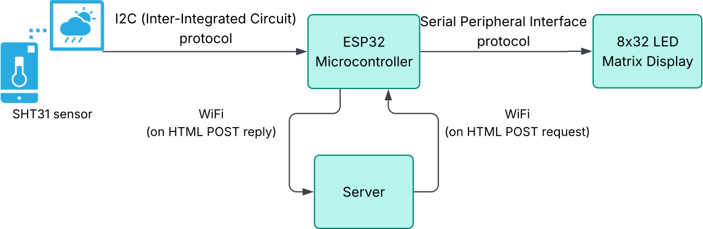
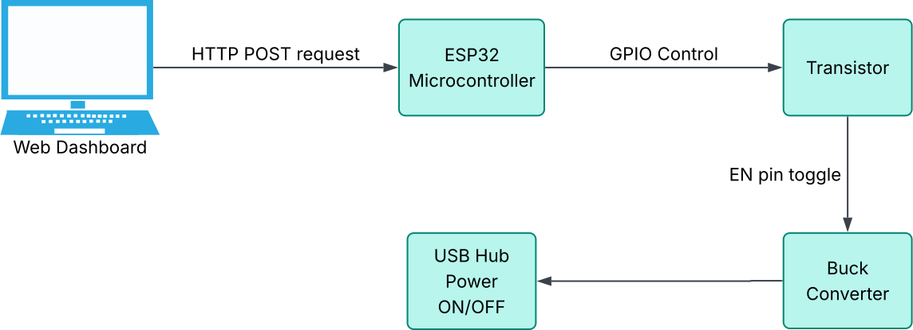

# HubVolt & AtmoSync — Hardware & Firmware Resources


---

## Introduction

This repository contains all hardware, firmware, and design resources for the **HubVolt** and **AtmoSync** IoT projects.  
It is intended as a reference for circuit schematics, PCB manufacturing files, firmware, and enclosure designs.

---

## Folder Structure

```
All files/
├── AtmoSync/
│   ├── Schematic_AtmoSync_v1/      # KiCAD or PDF schematic files for AtmoSync
│   ├── AtmoSync.svg                # Schematic as SVG image
│   ├── AtmoSync_v1.ino             # Arduino/ESP32 firmware source code
│   └── Gerber_AtmoSync_v1.zip      # Gerber files for PCB fabrication
├── HubVolt/
│   ├── Enclosure_design/           # 3D enclosure design files (STL/STEP/etc.)
│   ├── Schematic_HubVolt_v1/       # KiCAD or PDF schematic files for HubVolt
│   ├── Gerber_HubVolt_v1.0.zip     # Gerber files v1.0 for PCB
│   ├── Gerber_HubVolt_v1.1.zip     # Gerber files v1.1 for PCB
│   ├── HubVolt.svg                 # Schematic as SVG image
│   └── HubVolt_v1.ino              # Arduino/ESP32 firmware source code
└── readme.md                       # This documentation file
```

---

## Resource Details

### AtmoSync

- **Schematic_AtmoSync_v1/**  
  Circuit schematic files for AtmoSync hardware (KiCAD or PDF).
- **AtmoSync.svg**  
  Schematic diagram as an SVG image for quick reference.  
  
- **AtmoSync_v1.ino**  
  Arduino/ESP32 firmware source code for AtmoSync device.
- **Gerber_AtmoSync_v1.zip**  
  Gerber files for PCB manufacturing (upload to your PCB fab house).

### HubVolt

- **Schematic_HubVolt_v1/**  
  Circuit schematic files for HubVolt hardware (KiCAD or PDF).
- **HubVolt.svg**  
  Schematic diagram as an SVG image for quick reference.  
  
- **HubVolt_v1.ino**  
  Arduino/ESP32 firmware source code for HubVolt device.
- **Gerber_HubVolt_v1.0.zip**  
  Gerber files for HubVolt PCB, version 1.0.
- **Gerber_HubVolt_v1.1.zip**  
  Gerber files for HubVolt PCB, version 1.1 (latest).
- **Enclosure_design/**  
  3D printable enclosure files for HubVolt (STL, STEP, or similar).

---

## How to Use

1. **Schematics:**  
   Open schematic files in KiCAD or your preferred viewer, or view the SVG for a quick look.

2. **Firmware:**  
   - Open `.ino` files in the Arduino IDE or PlatformIO.
   - Flash to ESP32 hardware as per project instructions.

3. **PCB Manufacturing:**  
   - Unzip the Gerber files and upload them to your PCB manufacturer.
   - Use the latest version for best results.

4. **Enclosure:**  
   - Open 3D design files in your CAD software or slicer.
   - Print or fabricate as needed.

---

## Notes

- All files are provided as-is for reference and reproduction.
- For full project documentation, see the main project repository or contact the authors.
- Hardware and firmware are open for educational and research use.

---

## Credits

Developed during the Summer Research Internship Program (SRIP) at IIT Gandhinagar.